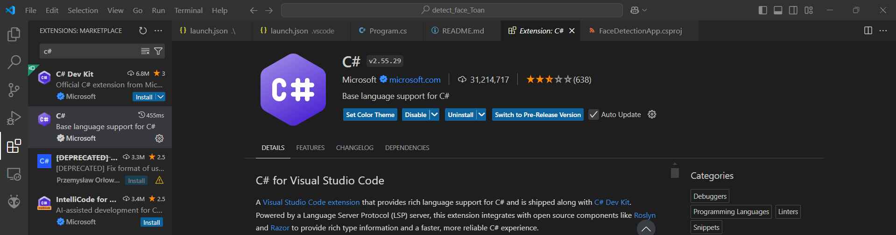
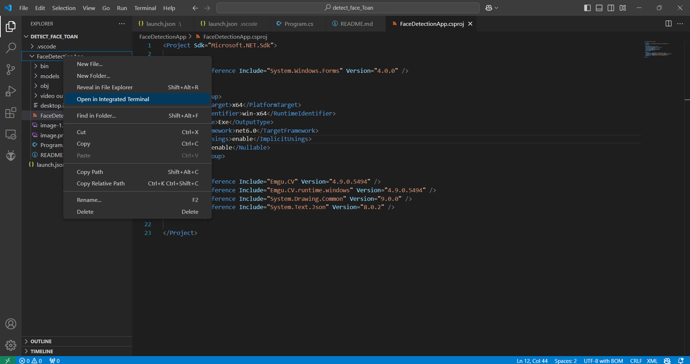
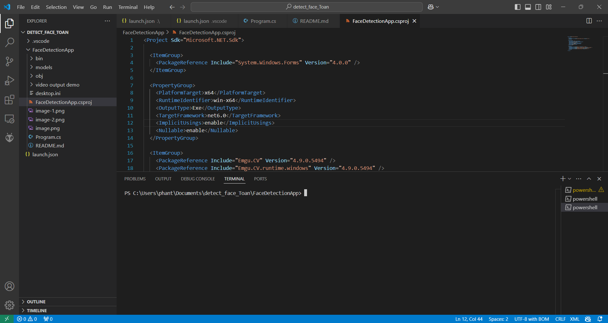

# hướng dẫn thực hiện

1. cài thư viện

**tải .NET SDK từ trang web chính thức, chọn NET 8, 9 ĐỀU OK. RECOMMEND 9**
```
https://dotnet.microsoft.com/download
```
**cài đặt VScode và tìm Extension, tải C# của Microsoft**



**cài đặt emgu.CV runtime qua NuGet**





chạy 2 lệnh sau để cài các gói runtime cần thiết: 

```
dotnet add package Emgu.CV --version 4.9.0.5494
dotnet add package Emgu.CV.runtime.windows --version 4.9.0.5494
```

_NOTE:_ Nếu muốn dùng GPU (CUDA) thì cài thêm runtime hỗ trợ GPU. Trường hợp dùng trực tiếp trên laptop Window thông thường thì không dùng.
```
dotnet add package Emgu.CV.runtime.windows.cuda --version 4.9.0.5494
```

2. Sau khi cài đặt, bạn có thể kiểm tra các gói đã thêm vào tệp .csproj của dự án:

Mở tệp .csproj trong VSCode, bạn sẽ thấy các dòng tương tự:

```
<ItemGroup>
  <PackageReference Include="Emgu.CV" Version="4.9.0.5494" />
  <PackageReference Include="Emgu.CV.runtime.windows" Version="4.9.0.5494" />
  <!-- Nếu cài CUDA runtime -->
  <PackageReference Include="Emgu.CV.runtime.windows.cuda" Version="4.9.0.5494" />
</ItemGroup>

```

**OK, GIỜ CHẠY CHƯƠNG TRÌNH:**

```
dotnet build
dotnet run
```

**kết quả như trong video trong thư mục _video output demo_**

bonus: 
link file prototxt:
[samples/dnn/face_detector/deploy.prototxt](https://github.com/opencv/opencv/blob/master/samples/dnn/face_detector/deploy.prototxt)

link file 
[res10_300x300_ssd_iter_140000.caffemodel](https://github.com/opencv/opencv_3rdparty/blob/dnn_samples_face_detector_20170830/res10_300x300_ssd_iter_140000.caffemodel)
